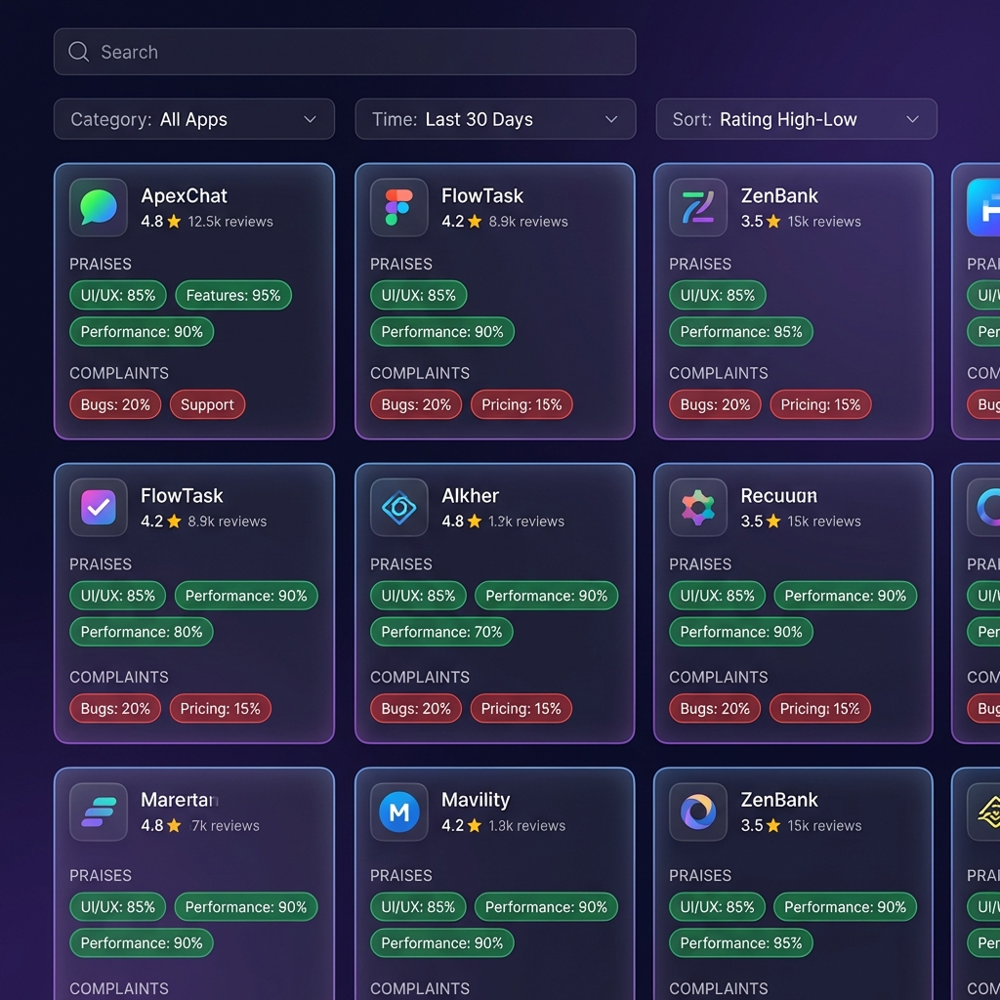

# 🎯 Offerwall Competitors Analysis Tool

A powerful Node.js tool for analyzing competitor apps in the offerwall/GPT (Get-Paid-To) space. This tool scrapes Google Play Store data, analyzes user reviews using sentiment analysis, and generates beautiful interactive HTML reports to help you understand the competitive landscape.



## ✨ Features

- **🔍 Smart Discovery**: Automatically discovers relevant competitor apps through:
  - Curated seed list of major offerwall apps (Swagbucks, Mistplay, Freecash, etc.)
  - Keyword-based search across 20+ targeted queries
  - Similar app recommendations from Google Play
  
- **🎯 Intelligent Filtering**: 
  - Filters out irrelevant apps (browsers, social media, utilities)
  - Focuses exclusively on offerwall/reward/GPT apps
  - Validates apps using positive/negative keyword matching

- **📊 Deep Review Analysis**:
  - Scrapes up to 3,000 reviews per app
  - Prioritizes longer, more insightful reviews
  - Categorizes feedback into granular themes:
    - **Praises**: pays_reliably, easy_to_use, fun_engaging, good_variety, fast_payout, etc.
    - **Complaints**: not_credited, withdrawal_issues, scam_suspicion, too_many_ads, etc.
  - Tracks "fixed issues" mentions

- **📈 Interactive HTML Report**:
  - Beautiful dark-themed dashboard with modern UI
  - Grid and table view modes
  - Real-time search and filtering
  - Sortable by reviews, rating, complaints, praises
  - Detailed modal views with screenshots
  - Expandable review examples for each theme
  - Fully responsive design

- **💾 Structured Data Export**:
  - JSON files for each app (reviews, images, summary)
  - Consolidated CSV export for spreadsheet analysis
  - Master JSON with all app data

## 🚀 Quick Start

### Prerequisites

- Node.js 14+ installed
- npm or yarn package manager

### Installation

```bash
# Clone the repository
git clone https://github.com/YOUR_USERNAME/test_competitors_analysis.git
cd test_competitors_analysis

# Install dependencies
npm install
```

### Usage

```bash
# Run the analysis
node index.js
```

The script will:
1. Discover apps via keywords and similar app recommendations (~5-10 minutes)
2. Fetch app details and filter for relevance
3. Scrape and analyze reviews
4. Generate outputs in the `out/` directory

### View Results

Open `out/report.html` in your browser to explore the interactive dashboard!

## 📁 Output Structure

```
out/
├── report.html              # Interactive HTML dashboard
├── apps.json                # All app data in JSON format
├── apps.csv                 # CSV export for spreadsheet analysis
└── [app-id]/                # Individual app directories
    ├── reviews.json         # Raw review data
    ├── images.json          # App icons, screenshots, videos
    └── summary.json         # Analyzed themes and metrics
```

## ⚙️ Configuration

Edit the `CONFIG` object in `index.js` to customize:

```javascript
const CONFIG = {
  lang: "en",                        // Language
  country: "us",                     // Country code
  appsPerKeyword: 20,                // Apps to fetch per keyword
  similarAppsPerApp: 5,              // Similar apps per seed app
  maxReviewsPerApp: 3000,            // Max reviews to analyze
  minTotalReviewsToInclude: 500,     // Minimum reviews threshold
  minReviewLength: 100,              // Min characters for analysis
  examplesPerCategory: 15,           // Review examples per theme
  delayBetweenRequests: 250,         // Rate limiting (ms)
};
```

### Customizing Seed Apps

Add or remove apps from `CONFIG.seededAppIds`:

```javascript
seededAppIds: [
  "com.prodege.swagbucksmobile",     // Swagbucks
  "com.mistplay.mistplay",           // Mistplay
  // Add your competitors here
],
```

### Customizing Keywords

Modify `CONFIG.keywords` to target specific niches:

```javascript
keywords: [
  "offerwall app",
  "GPT app earn",
  "paid surveys app",
  // Add your keywords here
],
```

## 🎨 Report Features

The generated HTML report includes:

- **📊 Summary Statistics**: Total competitors, reviews analyzed, average ratings
- **🔍 Search & Filter**: Real-time search by app name or developer
- **📋 Multiple Views**: Switch between grid cards and data table
- **🎯 Smart Sorting**: Sort by reviews, rating, complaints, or praises
- **🖼️ Screenshot Gallery**: View app screenshots with lightbox
- **💬 Review Examples**: Expandable categories with actual user quotes
- **🔗 Direct Links**: Quick access to Google Play Store listings

## 🛠️ Technical Details

### Dependencies

- **google-play-scraper**: Scrapes Google Play Store data
- **p-limit**: Concurrent request limiting
- **csv-stringify**: CSV export functionality

### Architecture

1. **Discovery Phase**: Builds app set from seeds, keywords, and similar apps
2. **Filtering Phase**: Validates relevance using keyword matching
3. **Analysis Phase**: Scrapes reviews and performs sentiment analysis
4. **Export Phase**: Generates JSON, CSV, and HTML outputs

### Rate Limiting

The tool includes built-in rate limiting (250ms between requests) to avoid hitting Google Play Store's rate limits. Adjust `CONFIG.delayBetweenRequests` if needed.

## 📊 Use Cases

- **Product Research**: Understand what users love/hate about competitors
- **Feature Prioritization**: Identify common pain points to solve
- **Market Analysis**: Discover emerging players in the offerwall space
- **Competitive Intelligence**: Track competitor ratings and review trends
- **Content Creation**: Generate insights for blog posts, reports, or presentations

## 🤝 Contributing

Contributions are welcome! Feel free to:

- Report bugs or issues
- Suggest new features or improvements
- Submit pull requests
- Share your analysis results

## 📝 License

This project is licensed under the MIT License - see the [LICENSE](LICENSE) file for details.

## ⚠️ Disclaimer

This tool is for research and educational purposes only. Please respect Google Play Store's Terms of Service and use responsibly. The scraping is done at a reasonable rate to avoid server overload.

## 🙏 Acknowledgments

- Built with [google-play-scraper](https://github.com/facundoolano/google-play-scraper)
- Inspired by the need for better competitive intelligence in the offerwall space

## 📧 Contact

For questions, suggestions, or collaboration opportunities, feel free to reach out!

---

**Made with ❤️ for the offerwall community**
